[TOC]

- [前排提示](#前排提示)
- [如何使用](#如何使用)
- [如何开始](#如何开始)
- [目前进度](#目前进度)
  - [已经完成的进度（2024/5/4更新）](#已经完成的进度202454更新)
    - [附属工作台](#附属工作台)
    - [下界之星聚变仪 ~~实际上可能没用的吉祥物~~](#下界之星聚变仪-实际上可能没用的吉祥物)
    - [原基聚变器](#原基聚变器)
    - [晶体温室](#晶体温室)
    - [天空祭坛](#天空祭坛)
    - [星能祭坛](#星能祭坛)
    - [矿物处理总成](#矿物处理总成)
    - [星辉造石机](#星辉造石机)
    - [浑元形意塑料机](#浑元形意塑料机)
    - [精灵？盖亚工坊~](#精灵盖亚工坊)
    - [源质凝聚台](#源质凝聚台)
    - [虚空采油机](#虚空采油机)
    - [末影冶炼炉](#末影冶炼炉)
    - [通灵能量发生器](#通灵能量发生器)
    - [矿物资源发生器](#矿物资源发生器)
    - [进阶流体发电机](#进阶流体发电机)
    - [空天能量注入器（测试）](#空天能量注入器测试)
    - [星辉树木拟生场（测试）](#星辉树木拟生场测试)
  - [准备制作的（2024.5.5）](#准备制作的202455)

---

**结构中的液体需要手动摆放，多方块构造器摆出来是不识别的**
**星辉造石机目前破坏的时候会有崩端的bug，目前无法修复。如果实在要破坏，解决办法是用mek的纸箱或者方块破坏器破坏后重启。**

# 前排提示

本附属纯粹个人爱好所做，仍处于开发中，平衡性以及稳定性皆不可保证，切勿跳脸非附属玩家

---

# 如何使用

如果下载的是release里的`multiblocked.zip`,则解压后将 `multiblocked` 文件夹放入 `<你的iv所在目录>/config` 中

如果下载的是源码（应该显示的是`ivtechsky-mbdaddition-main.zip`）则解压后仅将 `multiblocked` 文件夹放入 `<你的iv所在目录>/config` 中

`image`文件夹无用，纯属为了储存展示图片

**如果弹出重复文件，选择`全部替换`**

---

# 如何开始

**将27个`（也可以26个，将正面正上方的工作台换成物品容器）`摆成3*3的立方体，然后用工作台右键正面中央的工作台，就能做出附属工作台了**

# 目前进度

## 已经完成的进度（2024/5/4更新）

### 附属工作台
所有的多方块控制器都依赖这个多方块制作

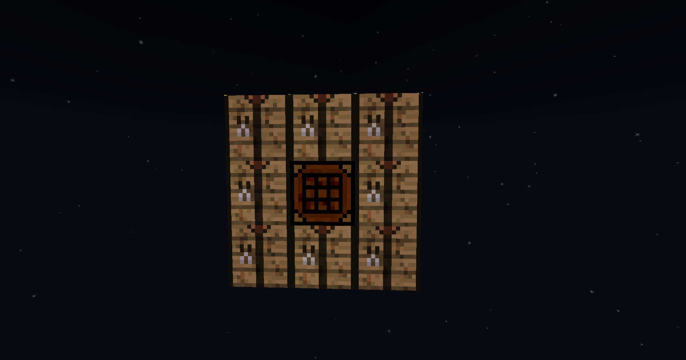

### 下界之星聚变仪 ~~实际上可能没用的吉祥物~~

能够通过下界之星和一些其他玩意进行超级发电的多方块（目前数据可能比较保守）

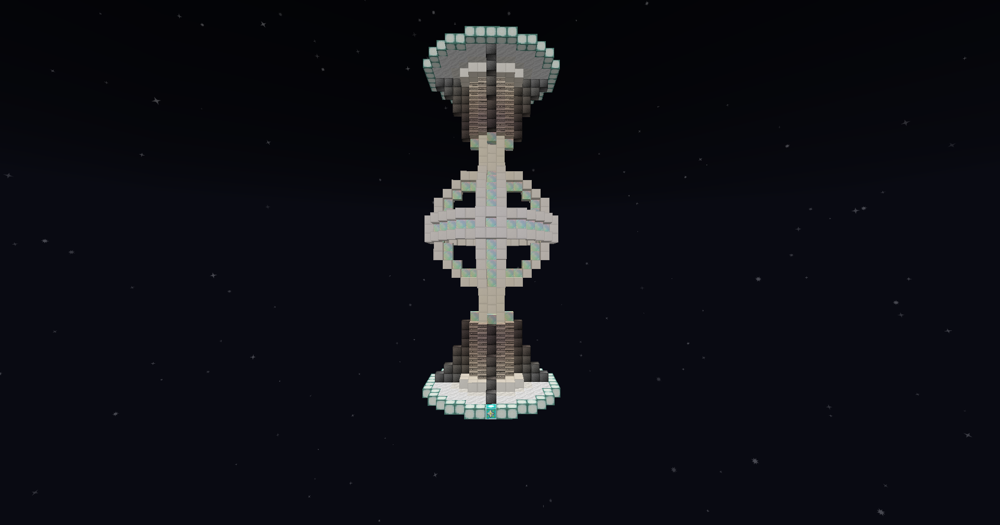

### 原基聚变器

能够将能量粉虚空变成原基的多方块（解决奇才便秘的原基反应）

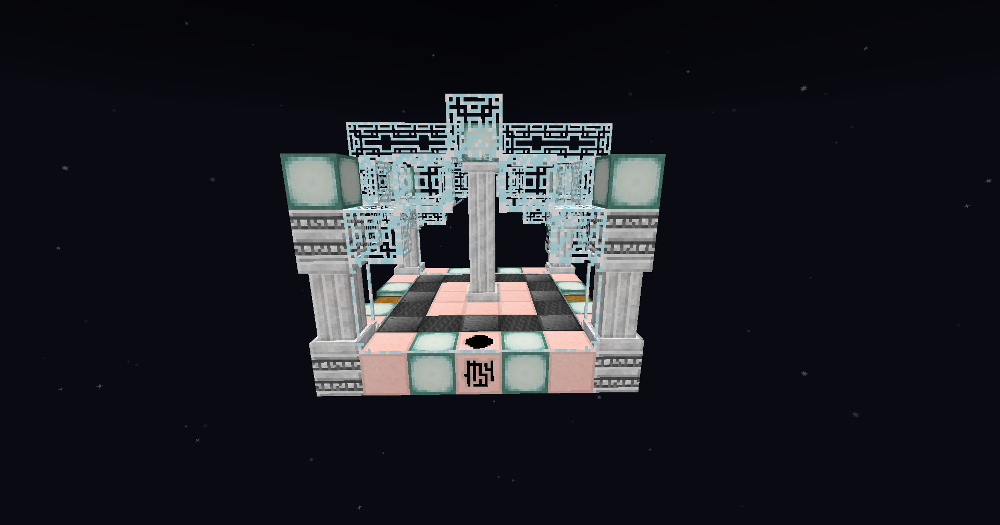

### 晶体温室

主要的几种水晶的产出

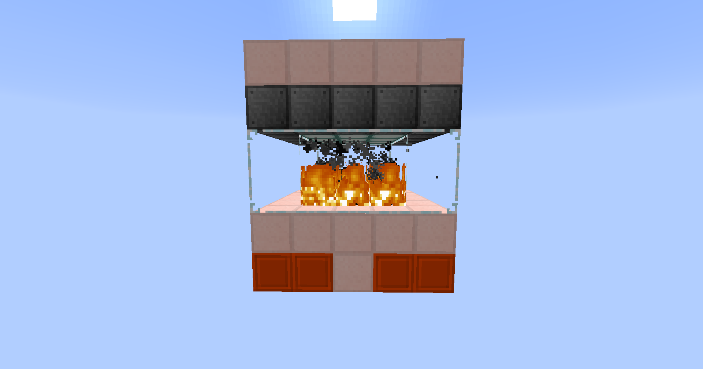

### 天空祭坛

部分自然灵气相关的配方（很庆幸的是这不消耗灵气）

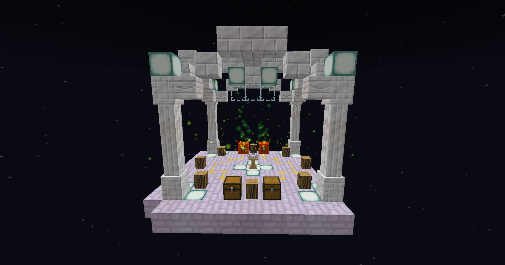

### 星能祭坛

添加星能液，海蓝宝石的获取，结构好做

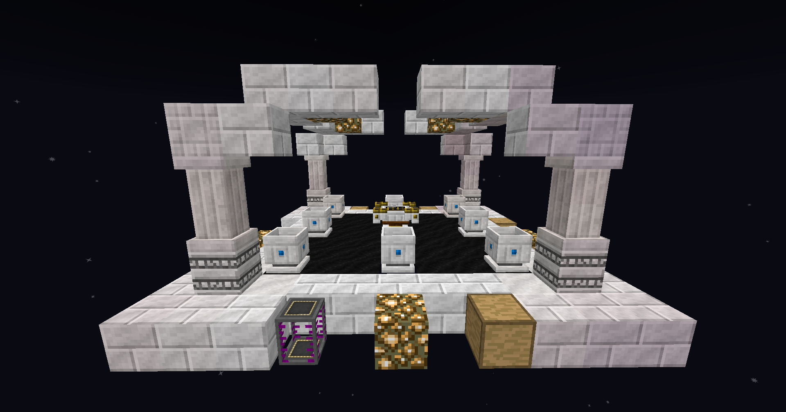

### 矿物处理总成

非常强大的矿处？（目前配方可能缺部分原矿的处理）

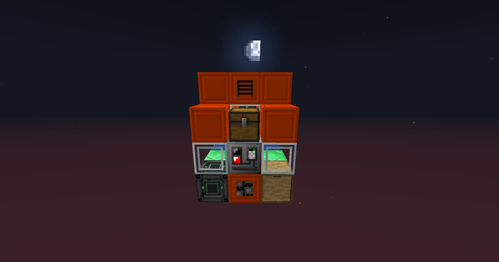

### 星辉造石机

可能有用的造石机？

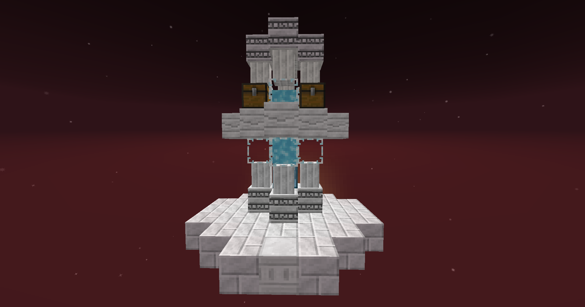

### 浑元形意塑料机

主打一个抽象的塑料制造机~~很难想象这么不合理的东西是怎么想出来的~~

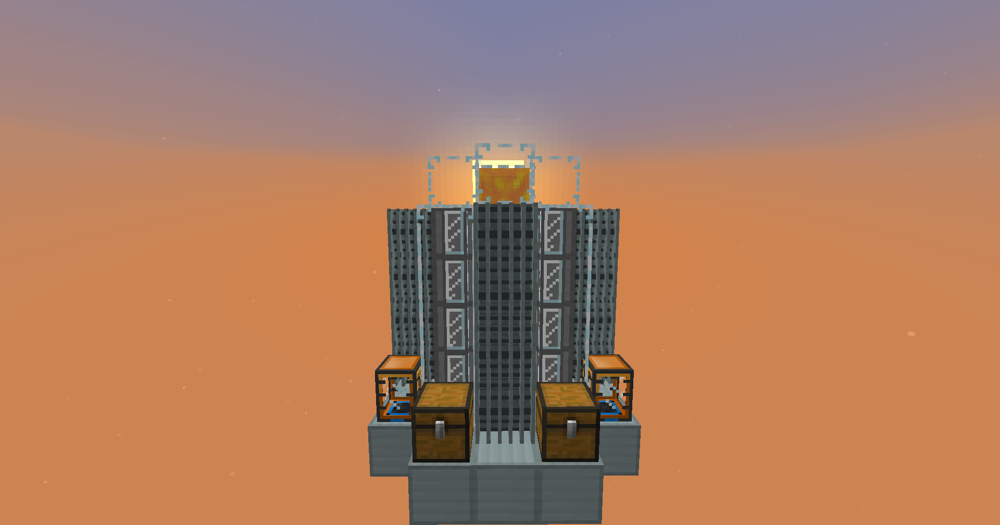

### 精灵？盖亚工坊~

一个不知道什么东西的东西？

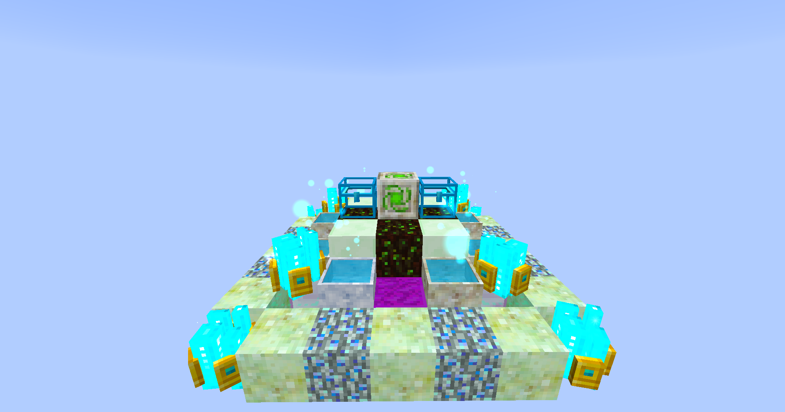

### 源质凝聚台

一个减少污染用的东西

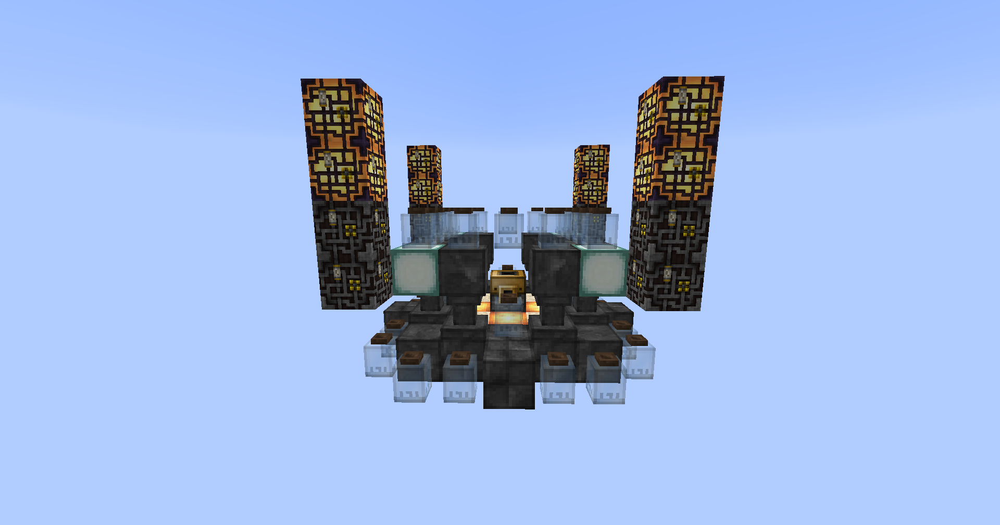

### 虚空采油机

石油不够用or找不到石油？那就用这个

### 末影冶炼炉

可能有用的末影珍珠制造器

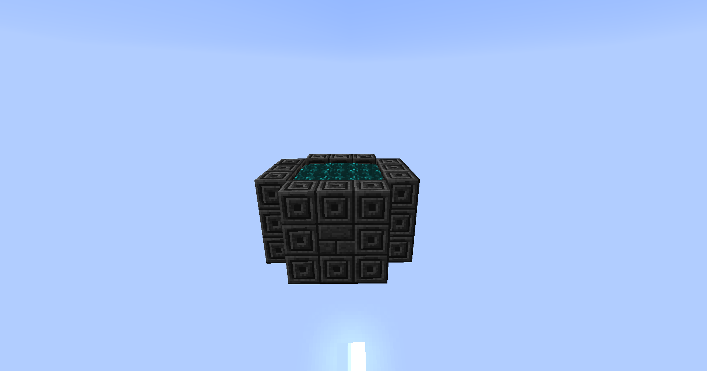

### 通灵能量发生器

没用的通灵树叶之类的用来发电吧

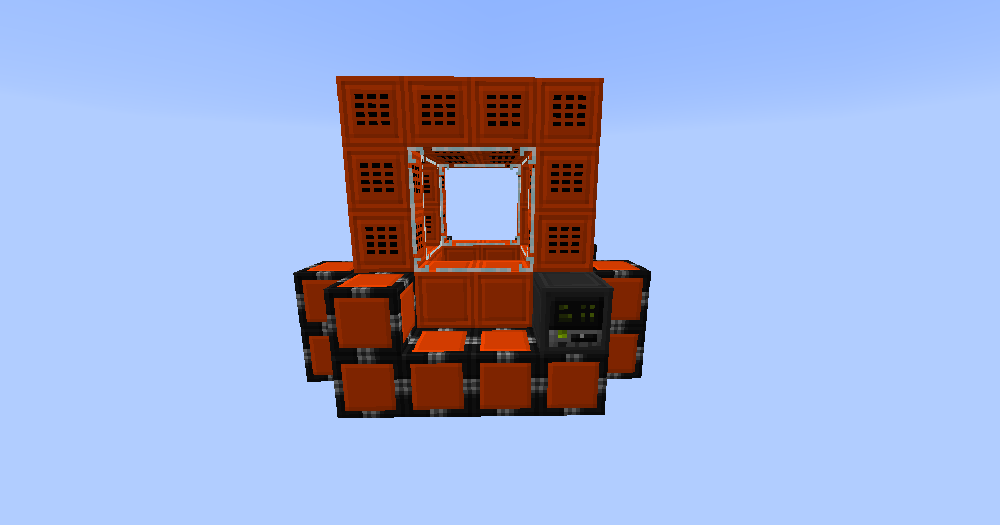

### 矿物资源发生器

一个大号的筛子？

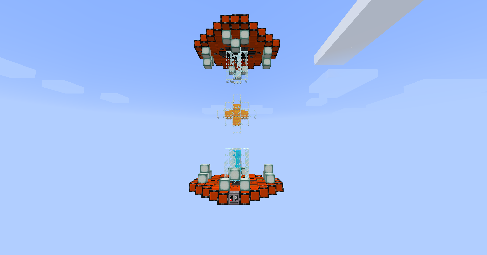

### 进阶流体发电机

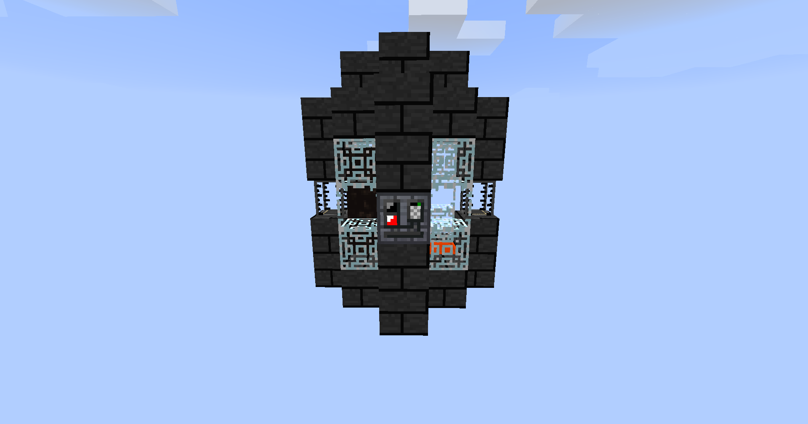

### 空天能量注入器（测试）

### 星辉树木拟生场（测试）

## 准备制作的（2024.5.5）

